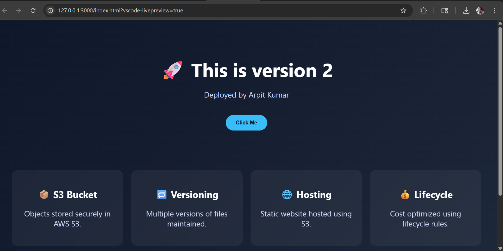
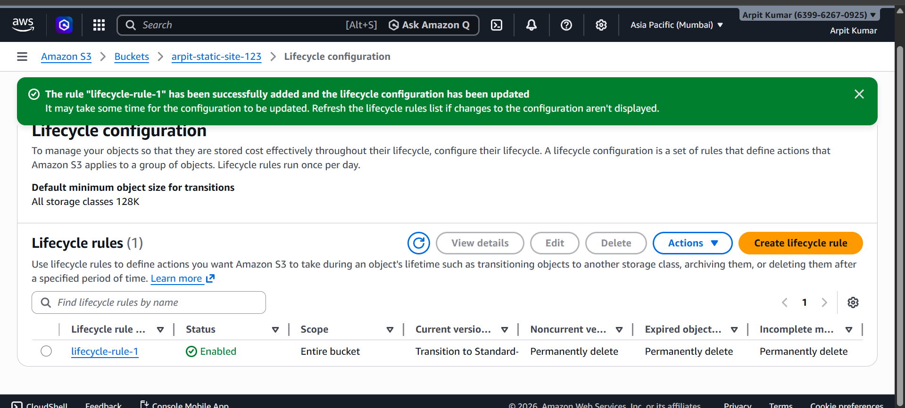

# AWS S3 Static Website Hosting with Versioning & Lifecycle Management

## 👤 Name:

Arpit Kumar

## 🎓 Registration Number:

12403384

---

## 🌐 Deployed Website Link:

http://arpit-static-site-123.s3-website.ap-south-1.amazonaws.com/

---

## 📸 Screenshots

### 1. S3 Bucket Objects

* Shows uploaded files inside the S3 bucket
* Includes `index.html` at root level
* AWS username visible

---

### 2. Versioning Enabled (Multiple Versions)

* Multiple versions of `index.html` visible
* “Show versions” toggle enabled
* Version IDs displayed
* AWS username visible

---

### 3. Static Website Hosting (Working)

* Website successfully deployed using S3
* URL visible in browser
* Page loads correctly

---

### 4. Lifecycle Rule Configuration

* Lifecycle rule created and enabled
* Transition to Standard-IA after 30 days
* Old versions deleted after 7 days
* AWS username visible

---

## ⚙️ Features Implemented

* Static Website Hosting using AWS S3
* Bucket Versioning enabled for maintaining multiple file versions
* Lifecycle Rules configured for:

  * Cost optimization (Standard → Standard-IA)
  * Automatic deletion of old versions
* Public access configured using Bucket Policy

---

## ⚠️ Challenges Faced

* Initially uploaded files before enabling versioning (fixed by re-uploading after enabling)
* Faced "Access Denied" error while opening website (resolved using bucket policy)
* Understanding lifecycle rules and correct configuration

---

## 🚀 Conclusion

This assignment helped in understanding how Amazon S3 can be used for static website hosting, managing versions of files, and optimizing storage costs using lifecycle rules. It provided hands-on experience with real-world cloud storage concepts.

---
